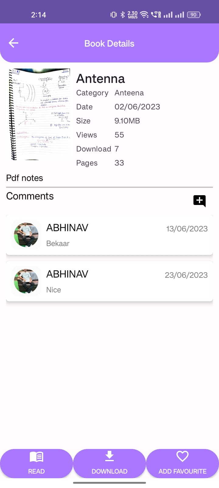

# ULib  

This is an e-library app where we can read ,download the pdf , books & magazines .We can login via admin account or users account . Admin have different features of making different type of categories of different books and the admin and users can see also how many downloads and views on the books ,pdfs.

##Logo

## Tech Stacks

\
[Firebase Authentication](https://firebase.google.com/docs/auth/android/start)

I have  used the firebase for authentication in the apps .Users and admins can register for this app by email and set password for their accounts. Users and admin accounts have also
the feature of email verification .

[Firebase realtime database](https://firebase.google.com/docs/database)
\
[Firebase storage](https://firebase.google.com/docs/storage)

I have used realtime database and storage  of firebase for the store the books ,pdfs , magazines and control the views and downloads of the books ,pdfs .

## Demo

Insert gif or link to demo

For Admin in my app 
* https://drive.google.com/file/d/1mtH73fxSdlZvTm0vRroUq51HWqO2IJkD/view?usp=drivesdk

For Users in my app

* https://drive.google.com/file/d/1mzFVNBQhOo_lfHn5ohjm0xlWXfBMclH9/view?usp=drivesdk

##ScreenShots
#Here, are the splash screen,home screen, and registration screen of the app.

#Here, are the login Screen, and forgot the password of the app.

#Here, are the dashboardUser, and dashboardAdmin the password of the app, which contain all the different categories and search option.

#Here,Admin have many features like adding new category, uploading new book , deleting books,category.

#Here ,User have also may features like add to favourite ,comment on the books, read the book and download .

#In this user have also an option to edit your profile and it contains all the info about favourite books , email verified ,email and other things also.

## Color Reference

| Color             | Hex                                                                |
| ----------------- | ------------------------------------------------------------------ |
|  White |  #FFFFFF |
|  Prple Color |  #B2A4FF |
|  grey |  #c5c5c5 |
|  dark Prple Color |  #AA77FF |

## Features

- Light/dark mode toggle
- search by name of books
- Fullscreen mode
- read the books
- download books
- add to favourite option
- Comment on books

  
## 🚀 About Me
I'm a Btech student of IIIT Allahabad. I have currently learned Android development in Kotlin and made some apps by the use of firebase authentication  and its realtime database

## 🔗 Links

## Installation
download the apk from my github repository.
for code you can use git clone~.
    

## Lessons Learned
In the developing this app, I learnt alot of things about firebase database and storage , how they can manage and shown on the screen .
Other things I have also learn about the architecture of an app like MVVM and others.

## Support

For support, email luciferabhinavdevil666@gmail.com.

